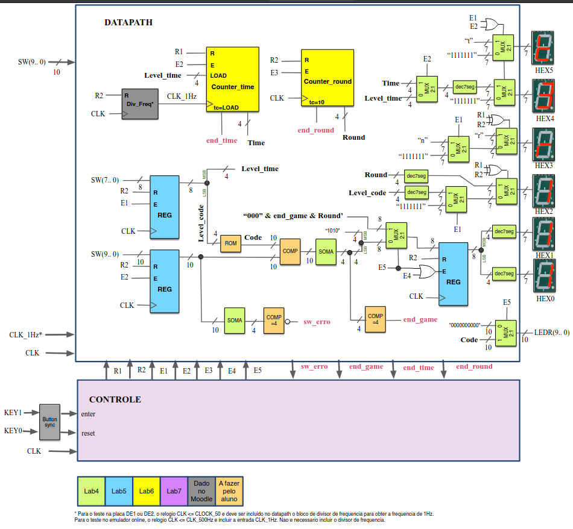

# EEL5105 - Circuitos e Técnicas Digitais

Alunos: Marina Benvenuti Cardeal e Yano de Melo Cavalcante

### Decifrador de Código
O projeto final da disciplina EEL5105 - Circuitos e Técnicas Digitais consiste na implementação de um circuito na placa de desenvolvimento DE2 fazendo uso das estruturas e conhecimentos obtidos durante o curso.
 O circuito desenvolvido visou implementar um jogo interativo para a obtenção de um código secreto de 10 bits. O comportamento do jogo a, partir de uma sequência de possíveis estaods, está definido a seguir:  
• O usuário começa no estado <em>Init</em> e dá início ao jogo pressionando o botão de pressão 'enter' (KEY1). Uma vez no estado <em>Setup</em> o usuário deve escolher uma das 16 sequências possíveis com os Switches 3 a 0, SW (3..0), as quais estão descritas numa memória ROM. Dita memória possui 16 linhas de informação de 10-bits (24 × 10). Cada um desses 16 vetores de 10 bits contém unicamente quatro ”1s” lógicos.  Os Switches 7 a 4, SW (7..4) servem para escolher o tempo de jogo por rodada, o aluno pode escolher entre
5 segundos, mínimo e 10 segundos, máximo. Neste estado, os displays HEX5 e HEX3 mostrarão a letra 't' de tempo
e 'n' de nível e os displays HEX4 e HEX2 mostrarão o valor do tempo e a linha da memória escolhida.  

<em>Exemplo em que foram selecionados 15 ('F' em Hexadecimal) segundos para cada rodada e o quarto nível.</em>

• Uma vez pressionado 'enter' novamente o jogo passa ao estado <em>Play</em> e se inicia o jogo. No estado <em>Play</em> o usuário tem o
valor do tempo escolhido para selecionar uma sequência usando os Switches SW (9..0). Neste estado, os displays
HEX5 e HEX4 mostrarão a letra 't' de tempo e uma contagem ascendente com frequência de 1Hz, respectivamente. É
importante destacar que o jogador, unicamente, pode introduzir quatro ”1s” lógicos por rodada. Se o jogador não pressionar
'enter' antes do final da contagem um sinal de status chamado end_time é ativado e o jogo vai para o estado <em>Result</em>,
pelo contrário, se o jogador seleciona uma sequência e pressiona enter antes do final da contagem o jogo vai para o estado <em>Count_Round</em>. 
• No estado <em>Count_Round</em> é feito a contagem de rodada e o jogo vai para o estado <em>Check</em>. Vale mencionar que em cada partida, o jogador possui, no máximo, 10 rodadas para adivinhar a sequência. 
• No estado <em>Check</em> são feitas as seguintes verificações:
<ol>
<li> O jogador não introduziu quatro ”1” lógicos nos Switches. É ativado, então, um sinal de status chamado sw_erro.</li>
<li> O jogador acabou o número de rodadas máximo. Caso o limite de 10 rodadas tenha sido atingido, um sinal de status chamado end_round será ativado.</li>
<li> O jogador adivinhou as posições dos quatro ”1” lógicos da sequência. Nesse caso, o jogador venceu e um sinal de status chamado end_game será ativado.
Caso um dos três sinais de status esteja ativo, o jogo vai para um estado <em>Result</em>, em caso contrário vai para um estado <em>Wait</em>.</li>
</ol>

• No estado <em>Wait</em>, os displays HEX3 e HEX2 mostrarão a letra 'r' de round e a contagem da rodada, respectivamente.
Nesse estado será zerada a contagem de tempo. Os displays HEX1 e HEX0 mostrarão a letra 'A' de acertos e o número de acertos, quando o jogador pressiona 'enter' e passa de novo ao estado <em>Play</em> para a seguinte rodada. 
 
<em>No exemplo, o jogador tentou os 4 primeiros Switches e nenhum estava correto. Assim, os mostradores apresentam o número da rodada "2" e o número de acertos "0".</em>

• No estado <em>Result</em> será mostrado nos LEDs vermelhos, LEDR(9..0), a sequência dos "1s" lógicos, correspondente ao nível que foi escolhido no início da partida. No estado <em>Result</em> é também mostrado o resultado do número de pontos em Hexadecimal nos displays HEX1 e HEX0. O resultado final seguirá a seguinte fórmula = 16 × end_game + Round'. Onde Round é o número de rodadas (a fórmula está expressada
em formato vetor no Datapath). O usuário deverá pressionar 'enter' para passar ao estado <em>Init</em> e iniciar outra partida. 
 
<em>Após acertar os 4 Switches, o jogo apresenta nos mostradores a soma de pontos em Hexadecimal, nesse caso, 28 pontos ou "1C". Os LEDs vermelhos mostram a sequência correta da memória.</em>

• Um usuário pode em, qualquer momento, parar o jogo usando o botão de pressão 'reset' (KEY0) zerando o sistema, retornando para o estado <em>Init</em> de novo e, essencialmente reiniciando a partida. 

O diagrama de blocos do circuito utilizado para a montagem do jogo:
 
<em>Diagrama de Blocos.</em>
